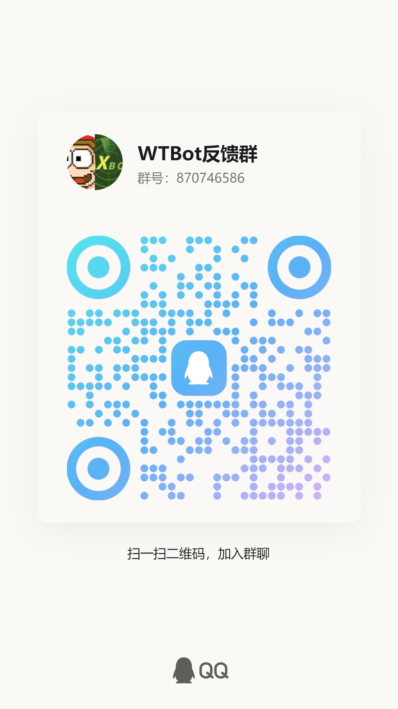

# 欢迎来到 WTBot 反馈仓库

这里是 WTBot 的反馈仓库，你可以在这里提交你的问题、建议、BUG 等。

## 为什么在这里反馈？

WTBot 的源代码托管于 GitHub，所以我们选择在 GitHub 上创建一个仓库来接收用户的反馈。你在这个仓库中创建的 Issue 都会作为最高优先级被开发者查看和处理。

> [!WARNING]
> 由于 WTBot 没有开放源代码，所以这里只是一个反馈仓库，仅做反馈用途。如果你想知道和 WTBot 源代码相关的信息，请联系开发者。

## 如何反馈？

使用 GitHub 的 Issue 来反馈问题，你可以点击 [这里](https://github.com/axbot-dev/wtbot-feedback/issues) 并按照模板填写 Issue。

如果没有合适的模板，你可以直接创建一个 Issue，但请确保你的 Issue 包含以下信息：

- 问题的描述
- 问题的复现步骤
- WTBot 的版本号 （使用 `/wt version` 命令获取）

## 其他反馈方式

如果你不知道该如何使用 GitHub，我们也提供了其他反馈方式，但请注意，其他渠道反馈的问题可能会被处理的更慢。

